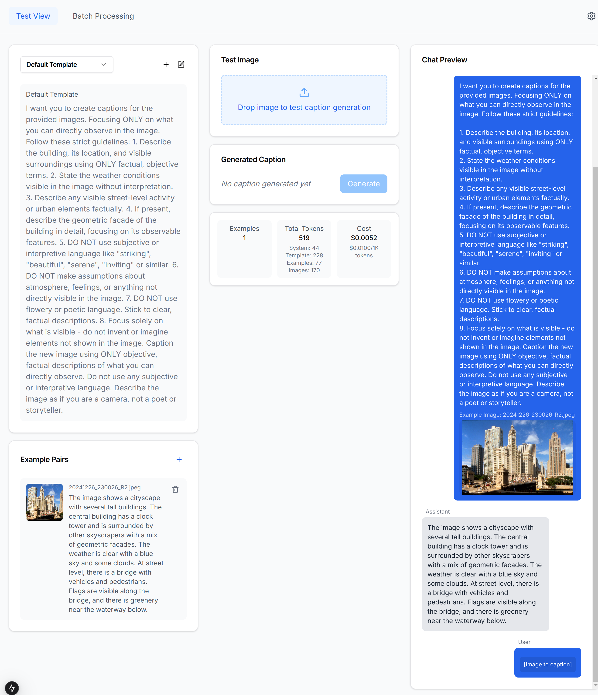
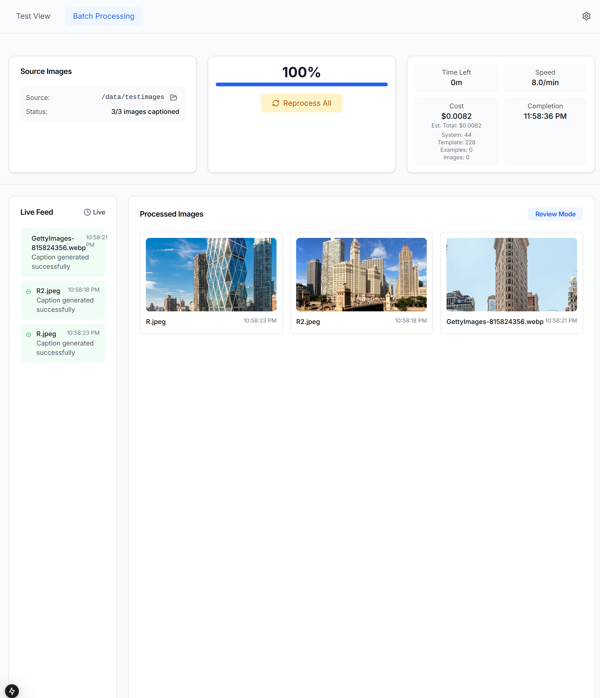
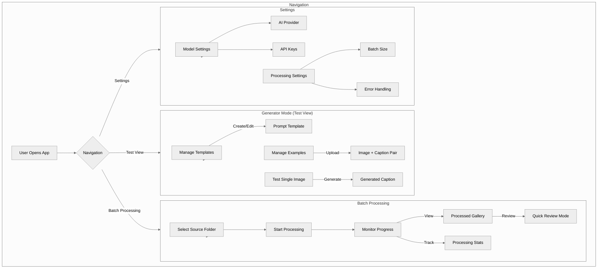

[](LICENSE.md)
[](README.md)

# Labela: AI Image Captioning Platform

Labela helps you generate high-quality captions for your images using AI models. It supports both experimenting with individual images and processing entire folders of images in batch.

## 🌟 Key Features

- Generate captions for single images to test and refine your approach
- Process entire folders of images in batch
- Review and edit generated captions
- Customize prompt templates to guide the AI's output
- Create example pairs to demonstrate your desired captioning style
- Supported AI providers: OpenAI

## 🚀 Getting Started

### Prerequisites
- Docker and Docker Compose
- OpenAI API key

### Installation

1. Clone the repository and enter the directory:
```bash
git clone https://github.com/TobiFank/labela.git
cd labela
```

2. Create and configure your environment file:
```bash
cp .env.template .env
# Edit .env and add your OpenAI API key
```

3. Build and start the application:

First time setup:
```bash
docker compose up --build
```

Subsequent runs:
```bash
docker compose up
```

4. Access the application:
- Web interface: http://localhost:3000

## 📁 Working with Images

### Image Organization
- Place your images in folders within the `/data` directory
- The `/data/examples` directory is reserved for example pairs, which are automatically stored there
- Captions are saved as `.txt` files alongside each image in their original folder

### Using the Application

#### Test View


- Create and manage prompt templates
- Add example image-caption pairs to guide the AI
- Test caption generation with individual images

#### Batch Processing


- Select a folder from your `/data` directory
- Monitor processing progress and costs
- Review generated captions in the gallery view
- Use Quick Review mode to efficiently edit captions

#### Quick Review Mode


- Enter Review Mode from the Batch Processing view
- Navigate through processed images with keyboard shortcuts
- View the full image alongside its caption
- Edit captions directly in the interface
- Changes are automatically saved to the caption files
- Exit review mode to return to the gallery view


## System Overview



## Contributing
Contributions are welcome! Please read our [Contributing Guidelines](CONTRIBUTING.md) before submitting changes.

## License
This project is licensed under a Custom Non-Commercial License. See [LICENSE](LICENSE.md) for full details.

## Acknowledgments
- Anthropic, OpenAI, and the Huggingface team for their excellent models
- The open-source community for various supporting libraries
- All contributors who have helped improve this project

## Support My Work

If you find Labela useful and want to help me keep developing innovative, open-source tools, consider supporting me by buying me a token. Your support helps cover development costs and allows me to create more projects like this!

[Buy me a token!](https://buymeacoffee.com/TobiFank)

Or, scan the QR code below to contribute:


Thank you for your support! It truly makes a difference.
